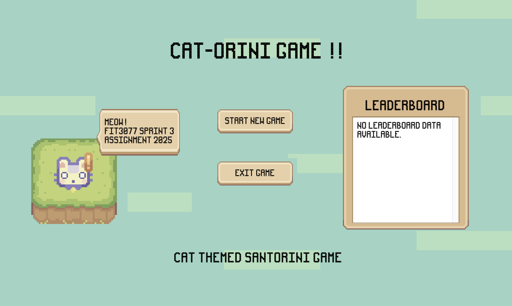
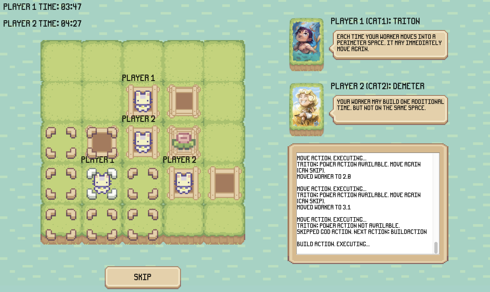
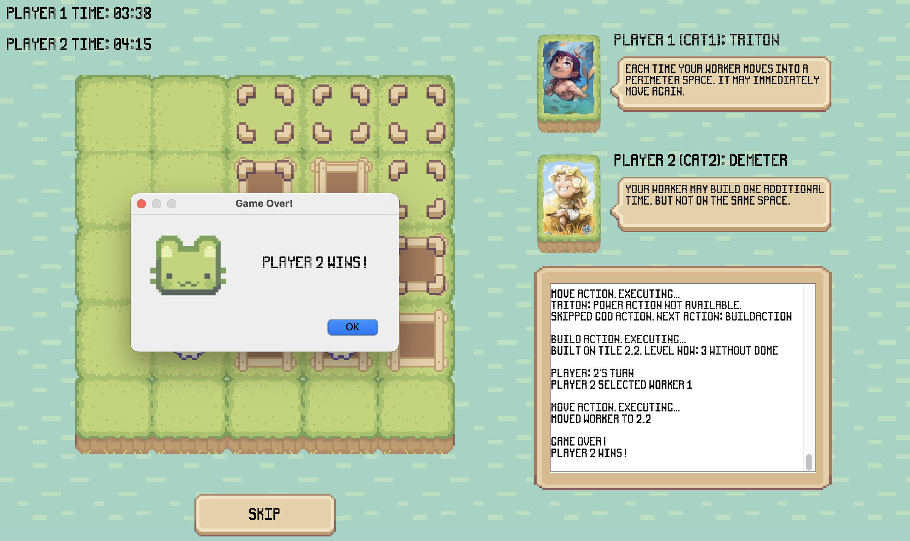

# Santorini Game Repository

This repository contains the source code for the Santorini-inspired game developed for a class project.

You can play the game by downloading the repo and opening the existing SantoriniGame.jar file in application folder

---

## Repository Organisation

The repository is structured as follows:

*   **`application/`**: Contains all source code (`.java` files) and resources for the Santorini game application. This directory includes:
    *   `resources/`: Where all the resources for the UI and MANIFEST file are located.
    *   `src/`: Contains all source code (`.java` files) for the Santorini game application.
    *   `SantoriniGame.jar`: Executable file for the entire Santorini application in a `.jar` format.
    *   `leaderboard.txt`: File used to store leaderboard win data.

*   **`README.md`**: Contains information about repository structure and organisation.
---

## Instructions on how to build and run the game: 

Download JDK:

*   Install JDK21 on whichever machine that will be running the software.
    *   Linux: [Download JDK21] (https://www.oracle.com/au/java/technologies/downloads/#java21)
    *   macOS: [Download JDK21] (https://www.oracle.com/au/java/technologies/downloads/#jdk21-mac)
    *   Windows: [Download JDK21] (https://www.oracle.com/au/java/technologies/downloads/#jdk21-windows)
*   Complete the installation of the Java JDK by following the steps of the installer. 

SDK Set up:
*   Set up the SDK for the file by going to:
    *   "File -> Project Structure..." (Shortcut: "Ctrl + Alt + Shift + S") - Click on the "Project" Tab.
    *   Under project, click on the drop-down bar next to the sub-heading SDK.
    *   Click on "+ ADD SDK" and then "JDK...", find the directory of the downloaded JDK and click on the whole file to add the JDK to the project.
    *   Click on "Apply" then "OK" to finish the SDK set up.

Build Executable:
*   Set up the SDK for the file by going to:
    *   "File -> Project Structure..." (Shortcut: "Ctrl + Alt + Shift + S")
    *   Click on the "Artifacts" Tab.
    *   On the top left of the window, a "+" symbol will be present, add a new artifact by clicking this.
    *   Click on the JAR title.
    *   Then click on the "From modules with dependencies..." title, a new window will appear.
    *   Next to the title "Main Class:" click on the folder icon and either search for the main class or select it from the “Project” menu. Click OK after selecting the main class.
    *   In the window now, you will see all the details for your artifact, feel free to rename the jar file as you please. For this project, I have renamed the jar file as “SantoriniGame.jar”.
    *   Click on "Apply" then "OK" to finish making an artifact set up.
    *   Navigate to the "Build" tab on the top of your IntelliJ window.
    *   Once it has been found, click on the tab and find the "Build Artifacts..." and select it.
    *   A pop-up will appear, click build.
    *   An executable has been created, it will be located in the out folder by default

Run Executable
*   Option 1:
    *   Locate the jar file and double click to open the executable.
*   Option 2:
    *   Change directory in the terminal to where the jar file is being kept.
    *   In the terminal write:
    *   java -jar SantoriniGame.jar
        This should open the executable jar file as required.
